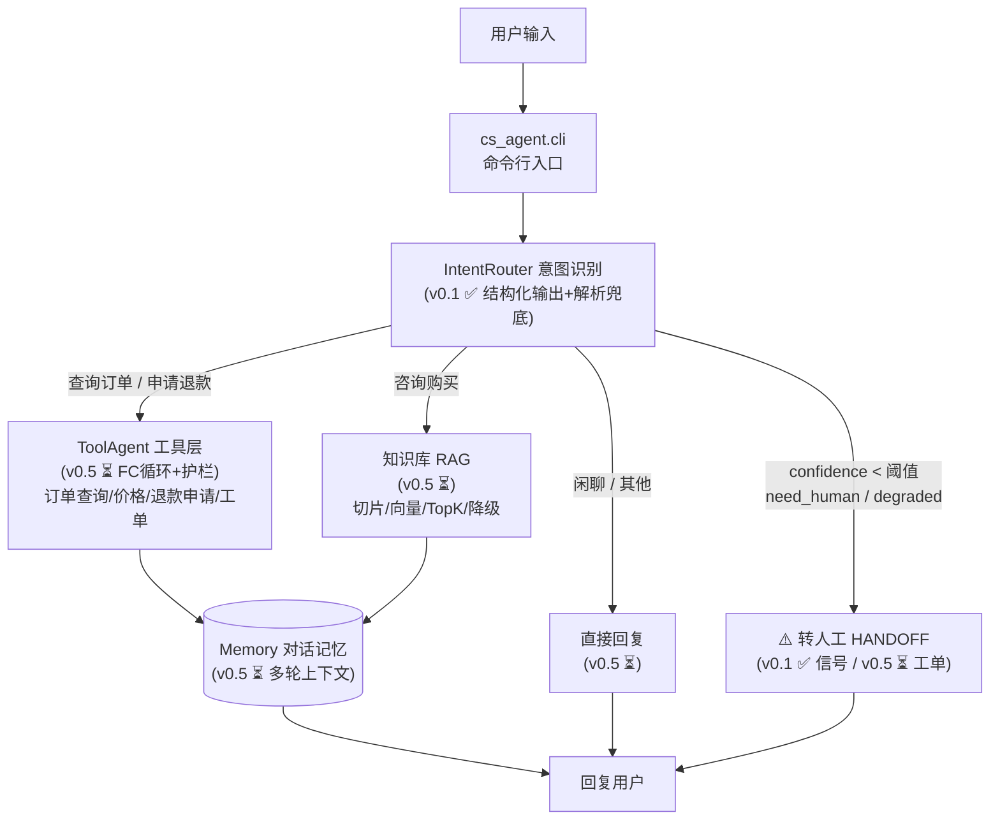

# cs-agent 架构设计（v0.1 定稿）

> 原则：**意图路由是分诊台，路由对了事半功倍，路由错了后面全白干。**
> 演进策略：手写内核 → 对照框架重构（v1 LangGraph），每个版本必须可运行。

## 一、总体架构



实线框 = v0.1 已落地；⏳ = roadmap 后续版本。

## 二、v0.1 模块职责

| 模块 | 文件 | 职责 | 关键设计 |
|------|------|------|----------|
| 配置 | `cs_agent/config.py` | .env 加载 + 配置自检 | frozen dataclass；按仓库根定位 .env，不依赖 CWD |
| LLM 客户端 | `cs_agent/llm.py` | OpenAI 兼容调用 + JSON 解析兜底 | 返回完整 message（不丢 tool_calls）；401/404/429 人话翻译；`parse_json_safely` 含花括号截取兜底 |
| 意图路由 | `cs_agent/intent.py` | 一句话 → 意图 JSON + 路由信号 | 意图枚举约束；confidence 钳位；低置信度/解析失败 → 转人工信号 |
| 入口 | `cs_agent/cli.py` | 单次模式 `--text` + 交互模式 | 输出意图 JSON + 路由信号（v0.1 验收标准） |
| 测试 | `tests/test_skeleton.py` | 无 API 骨架自检（15 例） | 解析兜底/防御性构造/Prompt 完整性/配置守卫 |

## 三、意图识别的数据流（v0.1 核心）

```

你敲命令: python -m cs_agent --text "..."
    │
    ▼
[__main__.py 第4行]
    │  from .cli import main;  main()
    ▼
[cli.py main() 第37-41行]
    │  ① Config.load() 读 .env
    │  ② 造 LLMClient（注入 config）
    │  ③ 造 IntentRouter（注入 llm）  ← 依赖注入
    │  ④ router.classify(text)
    ▼
[intent.py IntentRouter.classify() 第106-116行]
    │  打包 messages(system prompt + 用户话)
    │       │
    │       ▼
    │  [llm.py LLMClient.chat() 第51-95行]
    │      ① Config.require() 自检
    │      ② 拼 URL/headers/payload
    │      ③ requests.post 发 HTTP
    │      ④ 401/404/429 人话翻译
    │      ⑤ 返回 message dict
    │       │
    ▼       │
[intent.py 继续]
    │  parse_json_safely(content) 解析JSON
    │     ├─ 失败 → IntentResult.fallback() → degraded=True → 转人工
    │     └─ 成功 → IntentResult.from_dict(data, threshold)
    │                    逐字段防御校验（枚举/钳位/类型强转）
    ▼
[cli.py _print_result() 第16-26行]
    │  打印 JSON + should_handoff 路由信号
    ▼
  终端输出 ✅
```

## 四、关键设计决策（面试弹药）

1. **为什么先做意图路由，不直接上 Agent 循环？**
   意图是路由的依据：查订单走工具、商品咨询走 RAG、闲聊直接回复。
   路由是成本优化的第一道闸门——闲聊问题没必要进入 FC 循环（每次都是全量上下文往返）。

2. **转人工为什么有四个触发条件？**
   `need_human`（模型判断情绪/范围）+ `low_confidence`（统计信号）+ `degraded`（解析失败）+ 兜底优先。
   生产系统的降级路径必须比主路径更简单可靠——转人工就是那个"永远不会挂"的兜底。

3. **为什么解析失败不重试而直接降级？**
   v0.1 没有重试基础设施；降级（转人工）的代价远小于"错误路由"的代价。
   v0.5 引入重试时，也只对**可重试错误**（超时/限流）重试，语义错误重试没有意义。

4. **Prompt 即策略**：意图枚举写在 system prompt 里，模型只能从白名单选；
   非法值由 `from_dict` 兜回"其他"。**模型不可信假设**贯穿全链路。

## 五、v0.5 展望（接口已预留）

- `IntentResult.order_id` → 直接作为 `get_order_status` 的参数；
- `IntentRouter` 输出的 intent → 决定进入 ToolAgent / RAG / 直接回复；
- `should_handoff` → 对接工单创建（v0.5 的转人工闭环）；
- Memory 模块挂在 Agent 层，意图识别保持无状态（分诊台不需要记病历）。
